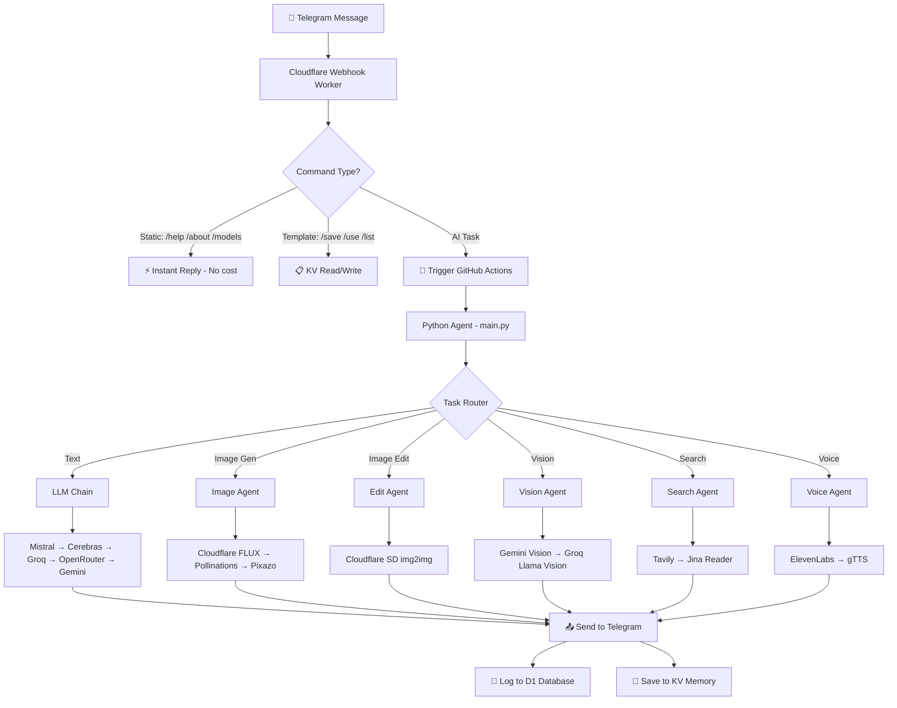

<div align="center">


<br/>

[](https://core.telegram.org/bots)
[](https://workers.cloudflare.com)
[](https://github.com/features/actions)
[](https://python.org)

<br/>

[-00d26a?style=flat-square)]()
[]()
[]()
[]()
[](LICENSE)
[](https://github.com/basavarajpatil660/ultimate-ai-agent/stargazers)

<br/>

> **"A fully serverless AI system — message your Telegram bot, get AI images, voice, research, and more. Zero server. Zero cost."**

<br/>

[📸 Screenshots](#-screenshots) • [🚀 What It Does](#-what-it-does) • [📖 How It Works](#-how-it-works) • [🤖 Commands](#-telegram-commands) • [🏗 Architecture](#-architecture) • [⚔️ vs Alternatives](#️-vs-alternatives) • [✅ Prerequisites](#-prerequisites) • [⚙️ Setup](#️-setup-guide) • [❓ FAQ](#-faq) • [🗺️ Roadmap](#️-roadmap) • [🤝 Contributing](#-contributing) • [👨‍💻 About](#-about-the-builder)

</div>

---

## 📸 Screenshots

> Real output. No staging. This is what the bot actually sends back.

<table>
<tr>
<td align="center" width="33%">

**🎨 Image Generation**
<br/>

<br/>
<sub>FLUX 1 Schnell via Cloudflare Workers AI</sub>

</td>
<td align="center" width="33%">

**✏️ Image Editing**
<br/>

<br/>
<sub>Stable Diffusion img2img — attach photo + prompt</sub>

</td>
<td align="center" width="33%">

**🔍 Web Research**
<br/>

<br/>
<sub>Tavily search + LLM synthesis</sub>

</td>
</tr>
</table>

> [!TIP]
> Replace the placeholder images above with real screenshots from your Telegram bot for maximum impact!

---

## 🚀 What It Does

<table>
<tr>
<td width="50%">

**For Users**
- 📸 Type a prompt → get an AI image in Telegram
- ✏️ Send a photo + instruction → AI edits it
- 🔍 Ask anything current → gets live web results
- 🎙️ Ask for voice → get an audio clip back
- 💬 Just talk → intelligent AI replies
- 🧠 It remembers context across sessions
- 📋 Save reusable image prompt templates
- ⚡ Trigger automations from Telegram

</td>
<td width="50%">

**For Developers / Recruiters**
- Multi-provider LLM fallback chain (5 providers)
- Serverless event-driven architecture
- Cloudflare Workers AI for FLUX image generation
- Persistent KV memory across stateless compute
- D1 SQLite for structured command logging
- GitHub Actions as zero-cost cloud compute
- React dashboard via authenticated REST API
- Webhook-based Telegram — no polling

</td>
</tr>
</table>

<div align="right"><a href="#top">↑ Back to Top</a></div>

---

## 📖 How It Works

> Simple version first. Technical depth in the collapsibles below.

```
You send a message to Telegram
        ↓
Cloudflare Worker receives it instantly (serverless edge)
        ↓
Simple commands? → Replied immediately (zero cost, zero delay)
AI task?         → GitHub Actions triggered via API
        ↓
Python agent runs in GitHub's free cloud compute
        ↓
Picks the best available AI provider automatically
        ↓
Result sent back to your Telegram
Memory + logs saved to Cloudflare D1 + KV
```

<details>
<summary><b>🔬 Deep Dive — Full Technical Flow</b></summary>

<br/>



</details>

<div align="right"><a href="#top">↑ Back to Top</a></div>

---

## 🤖 Telegram Commands

<details>
<summary><b>🎯 AI Task Commands</b></summary>

<br/>

| Command | What It Does | Example |
|---|---|---|
| `/image <prompt>` | Generate AI image using FLUX | `/image a cyberpunk city at night` |
| `/image_edit <prompt>` + photo | Edit your photo with AI | `/image_edit make it look like sunset` |
| `/image_read <question>` + photo | Analyze any image | `/image_read what's in this photo` |
| `/voice <text>` | Convert text to speech audio | `/voice good morning` |
| `/research <query>` | Live web search + AI summary | `/research latest AI news today` |
| `/content <topic>` | Social media caption generator | `/content Minecraft survival tips` |
| Just type anything | Auto mode — agent decides | `what is quantum computing` |

</details>

<details>
<summary><b>📋 Prompt Template System</b></summary>

<br/>

> Save your favourite image prompts with a `{X}` variable — reuse them forever.

| Command | What It Does |
|---|---|
| `/save_template <name> <prompt with {X}>` | Save a template |
| `/use_template <name> <subject>` | Generate image using template |
| `/list_templates` | Show all your saved templates |
| `/delete_template <name>` | Delete a template |

**Example:**
```
/save_template gaming a epic {X} gaming setup, cinematic lighting, 4K, ultra detailed

/use_template gaming RGB battlestation
→ Generates: "a epic RGB battlestation gaming setup, cinematic lighting, 4K, ultra detailed"
```

</details>

<details>
<summary><b>⚡ Automation + Info Commands</b></summary>

<br/>

| Command | What It Does |
|---|---|
| `/youtube_trends` | Trigger YouTube Trend Hunter agent |
| `/ai_trends` | Trigger AI News Hunter agent |
| `/status` | Live stats for today |
| `/models` | All AI models in use |
| `/providers` | Provider chain + free limits |
| `/modes` | What each mode does |
| `/about` | About this agent |
| `/help` | Full command list |

</details>

<div align="right"><a href="#top">↑ Back to Top</a></div>

---

## 🏗 Architecture

<details>
<summary><b>📐 Infrastructure Map</b></summary>

<br/>

| Layer | Service | What It Does | Cost |
|---|---|---|---|
| **Interface** | Telegram Bot | User input/output | Free |
| **Webhook** | Cloudflare Worker | Receives messages, routes commands | Free |
| **Image API** | Cloudflare Workers AI | FLUX gen + SD img2img | Free |
| **Compute** | GitHub Actions | Runs Python agent per task | Free |
| **Database** | Cloudflare D1 (SQLite) | Logs commands, images, runs | Free |
| **Memory** | Cloudflare KV | Private AI memory + templates | Free |
| **Dashboard** | React (Lovable) | Visual stats + history UI | Free |
| **Total** | | | **₹0/month** |

</details>

<details>
<summary><b>🤖 AI Provider Chains (with fallbacks)</b></summary>

<br/>

**💬 LLM Chain — 5 providers, auto-fallback:**
```
1. Mistral Large        → 1B tokens/month
       ↓ (if down)
2. Cerebras Llama 3.3   → 1M tokens/day  ⚡ fastest
       ↓ (if down)
3. Groq Llama 3.3       → 1K req/day
       ↓ (if down)
4. OpenRouter           → Free models (DeepSeek, Qwen3)
       ↓ (if down)
5. Google Gemini 2.5    → 1.5K req/day
```

**🎨 Image Generation Chain:**
```
1. Cloudflare FLUX 1 Schnell  → Primary
       ↓ (if down)
2. Pollinations AI             → Free, no key needed
       ↓ (if down)
3. Pixazo                     → Free tier fallback
```

**🔊 Voice / 👁 Vision / 🔍 Search chains also have fallbacks — all automatic.**

</details>

<details>
<summary><b>📁 Project Structure</b></summary>

<br/>

```
ultimate-ai-agent/
│
├── 📄 main.py                    # Entry point — task router + orchestrator
├── 📄 requirements.txt
│
├── 📂 agents/
│   ├── 🤖 llm_agent.py          # 5-provider LLM fallback chain
│   ├── 🎨 image_agent.py        # Image gen + img2img editing
│   ├── 👁  vision_agent.py      # Image analysis
│   ├── 🔍 search_agent.py       # Web research + LLM synthesis
│   ├── 📱 content_agent.py      # Social media content generation
│   └── 🔊 voice_agent.py        # Text-to-speech
│
├── 📂 core/
│   ├── 🧠 memory.py             # Cloudflare KV memory system
│   ├── 🗂  router.py            # Task type classifier
│   ├── 📝 formatter.py          # Output formatter
│   └── 📤 delivery.py           # Telegram send helpers
│
└── 📂 .github/workflows/
    ├── ⚡ agent.yml              # Main agent — triggered per task
    ├── 📅 daily.yml             # Scheduled content runs
    └── 🔄 ...                   # 8 total workflows
```

</details>

<details>
<summary><b>🗄 Database Schema (Cloudflare D1)</b></summary>

<br/>

```sql
CREATE TABLE commands (
  id          INTEGER  PRIMARY KEY AUTOINCREMENT,
  command     TEXT,
  mode        TEXT,
  prompt      TEXT,
  provider    TEXT,
  status      TEXT,
  created_at  DATETIME DEFAULT CURRENT_TIMESTAMP
);

CREATE TABLE images (
  id            INTEGER PRIMARY KEY AUTOINCREMENT,
  prompt        TEXT,
  template_name TEXT,
  file_id       TEXT,
  image_url     TEXT,
  created_at    DATETIME DEFAULT CURRENT_TIMESTAMP
);

CREATE TABLE automation_runs (
  id          INTEGER PRIMARY KEY AUTOINCREMENT,
  automation  TEXT,
  status      TEXT,
  created_at  DATETIME DEFAULT CURRENT_TIMESTAMP
);
```

</details>

<div align="right"><a href="#top">↑ Back to Top</a></div>

---

## ⚔️ vs Alternatives

> Honest comparison. No marketing fluff.

| Feature | **This Project** | n8n | Zapier AI | LangChain Bot | Custom GPT |
|---|---|---|---|---|---|
| Monthly Cost | **₹0** | $20+ | $49+ | Hosting cost | $20+ |
| Server Required | **No** | Yes | No | Yes | No |
| Image Generation | **Yes (FLUX)** | Plugin only | No | Depends | No |
| Image Editing | **Yes (img2img)** | No | No | No | No |
| Voice Output | **Yes** | No | Limited | Depends | No |
| Live Web Search | **Yes** | Via nodes | Yes | Depends | Yes |
| Persistent Memory | **Yes (KV)** | Yes | Yes | Depends | Limited |
| Telegram Interface | **Native** | Via node | Via Zap | Custom | No |
| Free Tier Feasible | **Fully** | Limited | No | Partially | No |
| Owns Your Data | **Yes** | Yes | No | Yes | No |

> [!NOTE]
> This project is a **personal agent system** — not a SaaS tool. The advantage is full ownership, zero cost, and complete customizability.

<div align="right"><a href="#top">↑ Back to Top</a></div>

---

## 🧠 Memory System

> The agent remembers context — even after GitHub Actions shuts down.

```
GitHub Actions run ends → state is gone (stateless compute)
                ↓
Agent saves context to Cloudflare KV before exiting
                ↓
Next run loads memory from KV
                ↓
Agent has full context — who you are, recent conversation
```

| KV Key | What's Stored |
|---|---|
| `agent_state` | Agent preferences and configuration |
| `conversation` | Recent conversation context (5-min window) |
| `user_profile` | Preferences, projects, style |

> [!IMPORTANT]
> Memory is stored **privately in Cloudflare KV** — never committed to this repo.

<div align="right"><a href="#top">↑ Back to Top</a></div>

---

## ⏰ Scheduled Runs

The agent runs automatically at these times (IST) with no input needed:

```
6:00 AM  →  Morning briefing
10:00 AM →  Content idea generation
3:00 PM  →  Research run
8:00 PM  →  AI news briefing
12:00 AM →  Night summary
```

In auto mode it generates content ideas + AI news and sends directly to Telegram.

<div align="right"><a href="#top">↑ Back to Top</a></div>

---

## ✅ Prerequisites

Before setting up, make sure you have:

- [ ] A **Cloudflare account** (free) — [cloudflare.com](https://cloudflare.com)
- [ ] A **GitHub account** (free) — [github.com](https://github.com)
- [ ] A **Telegram account** — [telegram.org](https://telegram.org)
- [ ] API keys from the providers listed in the Setup Guide below (all free tier)
- [ ] Basic understanding of environment variables and GitHub Secrets

> [!NOTE]
> No local development environment needed. Everything runs in the cloud.

<div align="right"><a href="#top">↑ Back to Top</a></div>

---

## ⚙️ Setup Guide

<details>
<summary><b>Step 1 — Cloudflare Setup</b></summary>

<br/>

1. Create a **Cloudflare account** at [cloudflare.com](https://cloudflare.com)
2. Create **two Workers** in the dashboard:
   - `github-backend` — webhook + dashboard API
   - `image-api` — FLUX generation + img2img editing
3. Create a **D1 Database** named `agent-db`
4. Run the SQL schema (from Architecture section above) in D1
5. Create **two KV Namespaces:**
   - `MEMORY_KV` — for agent memory
   - `TEMPLATES_KV` — for prompt templates
6. Bind D1 + both KV namespaces to `github-backend` worker
7. Bind Workers AI + KV to `image-api` worker

</details>

<details>
<summary><b>Step 2 — Telegram Bot</b></summary>

<br/>

1. Open Telegram → message [@BotFather](https://t.me/BotFather)
2. Send `/newbot` and follow the steps
3. Copy your **bot token**
4. Get your **chat ID** via [@userinfobot](https://t.me/userinfobot)
5. Set your webhook:
```
https://api.telegram.org/bot<YOUR_TOKEN>/setWebhook?url=https://<your-worker>.workers.dev
```

</details>

<details>
<summary><b>Step 3 — GitHub Secrets + Environment Variables</b></summary>

<br/>

Go to your repo → **Settings → Secrets and variables → Actions** → add these:

| Secret | Where To Get It | Required | Type |
|---|---|---|---|
| `TELEGRAM_BOT_TOKEN` | BotFather | ✅ Yes | String |
| `TELEGRAM_CHAT_ID` | @userinfobot | ✅ Yes | String |
| `CLOUDFLARE_WORKER_URL` | github-backend worker URL | ✅ Yes | URL |
| `CLOUDFLARE_API_KEY` | Set in image-api worker vars | ✅ Yes | String |
| `DASHBOARD_API_KEY` | Any strong secret you choose | ✅ Yes | String |
| `MISTRAL_API_KEY` | [console.mistral.ai](https://console.mistral.ai) | ✅ Yes | String |
| `CEREBRAS_API_KEY` | [cloud.cerebras.ai](https://cloud.cerebras.ai) | ⚡ Recommended | String |
| `GROQ_API_KEY` | [console.groq.com](https://console.groq.com) | ⚡ Recommended | String |
| `OPENROUTER_API_KEY` | [openrouter.ai](https://openrouter.ai) | Optional | String |
| `GOOGLE_AI_KEY` | [aistudio.google.com](https://aistudio.google.com) | Optional | String |
| `ELEVENLABS_API_KEY` | [elevenlabs.io](https://elevenlabs.io) | Optional | String |
| `TAVILY_API_KEY` | [tavily.com](https://tavily.com) | Optional | String |
| `JINA_API_KEY` | [jina.ai](https://jina.ai) | Optional | String |
| `GMAIL_ADDRESS` | Your Gmail address | Optional | Email |
| `GMAIL_APP_PASSWORD` | Gmail → Security → App Passwords | Optional | String |

> [!TIP]
> Every provider above has a **free tier**. No credit card required for any of them. Optional secrets just disable that feature if missing — nothing breaks.

**Example `.env` format (for reference only — never commit this file):**
```env
TELEGRAM_BOT_TOKEN=YOUR_BOT_TOKEN_HERE
TELEGRAM_CHAT_ID=YOUR_CHAT_ID_HERE
CLOUDFLARE_WORKER_URL=YOUR_WORKER_URL_HERE
CLOUDFLARE_API_KEY=YOUR_API_KEY_HERE
DASHBOARD_API_KEY=YOUR_DASHBOARD_KEY_HERE
MISTRAL_API_KEY=YOUR_MISTRAL_KEY_HERE
CEREBRAS_API_KEY=YOUR_CEREBRAS_KEY_HERE
GROQ_API_KEY=YOUR_GROQ_KEY_HERE
OPENROUTER_API_KEY=YOUR_OPENROUTER_KEY_HERE
GOOGLE_AI_KEY=YOUR_GOOGLE_KEY_HERE
ELEVENLABS_API_KEY=YOUR_ELEVENLABS_KEY_HERE
TAVILY_API_KEY=YOUR_TAVILY_KEY_HERE
JINA_API_KEY=YOUR_JINA_KEY_HERE
GMAIL_ADDRESS=YOUR_GMAIL_HERE
GMAIL_APP_PASSWORD=YOUR_APP_PASSWORD_HERE
```

</details>

<details>
<summary><b>Step 4 — Deploy & Test</b></summary>

<br/>

1. Copy worker code into your Cloudflare Workers
2. Deploy both workers from the Cloudflare dashboard
3. Add all secrets to your GitHub repo
4. Send `/help` to your Telegram bot
5. You're live ✅

</details>

<div align="right"><a href="#top">↑ Back to Top</a></div>

---

## 📊 Why This Approach?

| Feature | This Project | Typical AI Chatbot |
|---|---|---|
| Monthly Cost | **₹0** | $20–$100+ |
| Server Required | **No** | Yes |
| Credit Card | **No** | Yes |
| Runs 24/7 | **Yes (scheduled)** | Needs paid hosting |
| Image Generation | **Yes (FLUX)** | Rarely included |
| Image Editing | **Yes (img2img)** | No |
| Voice Output | **Yes** | No |
| Live Web Search | **Yes** | No |
| Persistent Memory | **Yes (private KV)** | No |

<div align="right"><a href="#top">↑ Back to Top</a></div>

---

## 🏆 Technical Highlights

```
✅ Event-driven serverless architecture — zero idle cost
✅ 5-layer LLM fallback chain — never fully goes down
✅ Stateless compute with stateful memory (KV bridge pattern)
✅ Cloudflare Workers AI for edge-native image generation
✅ D1 SQLite for structured observability and logging
✅ React dashboard connected via authenticated REST API
✅ GitHub Actions as free cloud compute (2,000 min/month)
✅ Webhook-based Telegram integration (no polling)
✅ img2img pipeline via Stable Diffusion on Workers AI
✅ Multi-modal: text + image + audio + vision + search
```

<div align="right"><a href="#top">↑ Back to Top</a></div>

---

## ❓ FAQ

<details>
<summary><b>Is this really free?</b></summary>

Yes. Every provider used has a free tier generous enough for personal use:
- Cloudflare Workers: 100,000 requests/day free
- GitHub Actions: 2,000 minutes/month free
- Mistral: 1B tokens/month free
- Groq: 1K requests/day free
- ElevenLabs: 10K characters/month free
- Tavily: 1K searches/month free

</details>

<details>
<summary><b>What happens when a provider hits its free limit?</b></summary>

The agent automatically skips to the next provider in the chain. For example if Mistral is at its limit, it tries Cerebras, then Groq, then OpenRouter, then Gemini — all without any action from you.

</details>

<details>
<summary><b>Is my data safe?</b></summary>

Yes. All memory and personal data is stored in your own **private Cloudflare KV namespace** — it never touches this public repo. API keys are stored as GitHub Secrets and Cloudflare environment variables — never in code.

</details>

<details>
<summary><b>Can I run this without all the API keys?</b></summary>

Yes, partially. The agent degrades gracefully — if a key is missing, it skips that provider. At minimum you need `TELEGRAM_BOT_TOKEN`, `TELEGRAM_CHAT_ID`, `CLOUDFLARE_WORKER_URL`, and at least one LLM key (Groq is recommended as the free tier is generous).

</details>

<details>
<summary><b>Does it work without a PC?</b></summary>

Yes — the entire system runs in the cloud. You only need a Telegram app to use it. Setup requires a browser to configure Cloudflare and GitHub.

</details>

<details>
<summary><b>How do I add my own commands?</b></summary>

Edit the Cloudflare webhook worker (`github-backend`) to add new command handlers, and add the corresponding agent logic in `main.py` and the `agents/` folder. The architecture is modular by design.

</details>

<details>
<summary><b>Troubleshooting — common issues</b></summary>

<br/>

**Bot not responding?**
- Check your Cloudflare Worker is deployed and webhook is set correctly
- Verify `TELEGRAM_BOT_TOKEN` and `TELEGRAM_CHAT_ID` secrets are correct

**Image generation returning blank/black image?**
- Cloudflare FLUX may be rate limited — Pollinations AI fallback will kick in automatically
- Check your `CLOUDFLARE_API_KEY` matches the `API_KEY` variable in your image-api worker

**GitHub Actions not triggering?**
- Check `GITHUB_TOKEN` has `workflow` permission in your repo settings
- Verify `CLOUDFLARE_WORKER_URL` points to `github-backend` not `image-api`

**Memory not persisting?**
- Ensure `MEMORY_KV` binding is correctly attached to your `github-backend` worker
- Check `DASHBOARD_API_KEY` is set in both GitHub Secrets and Cloudflare Worker vars

</details>

<div align="right"><a href="#top">↑ Back to Top</a></div>

---

## 🗺️ Roadmap

> What's planned next. Track progress on the [GitHub Project Board](https://github.com/basavarajpatil660/ultimate-ai-agent/projects).

| Status | Feature |
|---|---|
| ✅ Done | FLUX image generation |
| ✅ Done | img2img image editing |
| ✅ Done | Private KV memory system |
| ✅ Done | 5-provider LLM fallback |
| ✅ Done | Voice output (ElevenLabs + gTTS) |
| ✅ Done | Live web search (Tavily + Jina) |
| ✅ Done | Prompt template system |
| ✅ Done | React dashboard |
| 🔄 In Progress | Dashboard bug fixes (Response column, automation counts) |
| 📋 Planned | Video generation agent |
| 📋 Planned | Scheduled task reminders |
| 📋 Planned | Multi-user support |
| 📋 Planned | WhatsApp interface |
| 💡 Ideas | Code execution agent |

<div align="right"><a href="#top">↑ Back to Top</a></div>

---

## 🔒 Security & Privacy

This repo contains **no real credentials** of any kind. Here's what was intentionally removed before publishing:

| What Was Removed | Replaced With |
|---|---|
| Hardcoded Worker URLs | `env.WORKER_URL` / `os.environ.get()` |
| API keys and tokens | GitHub Secrets via `${{ secrets.NAME }}` |
| Personal chat IDs | `env.TELEGRAM_CHAT_ID` |
| Personal email addresses | `os.environ.get("GMAIL_ADDRESS")` |
| Memory with personal details | Empty KV template structure |
| Debug files (`debug_kv.py`) | Deleted |

> [!WARNING]
> Never commit real API keys to any public repository. Always use GitHub Secrets for GitHub Actions and Cloudflare environment variables for workers.

<div align="right"><a href="#top">↑ Back to Top</a></div>

---

## 🤝 Contributing

Contributions are welcome! Here's how:

1. **Fork** this repo
2. **Create a branch** — `git checkout -b feature/your-feature`
3. **Make your changes** and test them
4. **Commit** — `git commit -m "feat: your feature description"`
5. **Push** — `git push origin feature/your-feature`
6. **Open a Pull Request** with a clear description

**Good areas to contribute:**
- New agent types (video, code execution, scheduling)
- Additional LLM provider integrations
- Dashboard improvements
- Documentation and examples
- Bug fixes

> [!NOTE]
> Please make sure no API keys or personal data are included in your PR.

<div align="right"><a href="#top">↑ Back to Top</a></div>

---

## 📜 License

MIT License — use it freely, learn from it, build on it.

See [LICENSE](LICENSE) for full details.

---

## 💬 Support / Get Help

Stuck on setup? Something not working?

- 🐛 **Bug?** → [Open an Issue](https://github.com/basavarajpatil660/ultimate-ai-agent/issues)
- 💡 **Feature idea?** → [Start a Discussion](https://github.com/basavarajpatil660/ultimate-ai-agent/discussions)
- 🗺️ **Track progress** → [Project Roadmap](https://github.com/basavarajpatil660/ultimate-ai-agent/projects)
- 📬 **Direct contact** → reach out via the social links below

<div align="right"><a href="#top">↑ Back to Top</a></div>

---

## 👨‍💻 About The Builder

<div align="center">

**Basavaraj M Patil (Nick)**

🎓 Computer Science Student &nbsp;|&nbsp; 🇮🇳 India

<br/>

[](https://linkedin.com/in/itsbasavarajmp)
[](https://github.com/basavarajpatil660)
[](https://instagram.com/basavaraj_nick)
[](https://youtube.com/@NickPlays)

<br/>

<a href="https://github.com/basavarajpatil660/ultimate-ai-agent/graphs/contributors">
  
</a>

</div>

---

<div align="center">

**If this project helped you or inspired you — drop a ⭐ It genuinely means a lot.**


</div>
