```mermaid
flowchart TD
    A[📱 Telegram Message] --> B[Cloudflare Webhook Worker]
    B --> C{Command Type?}
    C -->|Static: /help /about /models| D[⚡ Instant Reply - No cost]
    C -->|Template: /save /use /list| E[📋 KV Read/Write]
    C -->|AI Task| F[🚀 Trigger GitHub Actions]
    F --> G[Python Agent - main.py]
    G --> H{Task Router}
    H -->|Text| I[LLM Chain]
    H -->|Image Gen| J[Image Agent]
    H -->|Image Edit| K[Edit Agent]
    H -->|Vision| L[Vision Agent]
    H -->|Search| M[Search Agent]
    H -->|Voice| N[Voice Agent]
    I --> O[Mistral → Cerebras → Groq → OpenRouter → Gemini]
    J --> P[Cloudflare FLUX → Pollinations → Pixazo]
    K --> Q[Cloudflare SD img2img]
    L --> R[Gemini Vision → Groq Llama Vision]
    M --> S[Tavily → Jina Reader]
    N --> T[ElevenLabs → gTTS]
    O & P & Q & R & S & T --> U[📤 Send to Telegram]
    U --> V[💾 Log to D1 Database]
    U --> W[🧠 Save to KV Memory]
```

<div align="center">


<br/>

[](https://core.telegram.org/bots)
[](https://workers.cloudflare.com)
[](https://github.com/features/actions)
[](https://python.org)

<br/>

[-00d26a?style=flat-square&logo=googleplay&logoColor=white)]()
[]()
[]()
[]()
[](LICENSE)
[](https://github.com/basavarajpatil660/ultimate-ai-agent/stargazers)

<br/>

> **"A fully serverless AI system — just message your Telegram bot and get AI images, voice, research, and more. Zero server cost. Built on a phone."**

<br/>

[🚀 What It Does](#-what-it-does) • [📖 How It Works](#-how-it-works) • [🤖 Commands](#-telegram-commands) • [🏗 Architecture](#-architecture) • [⚙️ Setup](#️-setup-guide) • [👨‍💻 About](#-about-the-builder)

</div>

---

## 🚀 What It Does

> No jargon. Here's what you actually get when you message this bot:

<table>
<tr>
<td width="50%">

**For You (Normal User)**
- 📸 Type a prompt → get an AI image in Telegram
- ✏️ Send a photo + instruction → AI edits it
- 🔍 Ask anything current → gets live web results
- 🎙️ Ask for voice → get an audio clip back
- 💬 Just talk → it replies with AI smarts
- 🧠 It remembers who you are across sessions

</td>
<td width="50%">

**Under The Hood (For Recruiters)**
- Multi-provider LLM fallback chain (5 providers)
- Serverless event-driven architecture
- Cloudflare Workers AI for FLUX image generation
- Persistent KV memory across stateless runs
- D1 SQLite for structured command logging
- GitHub Actions as a zero-cost compute layer

</td>
</tr>
</table>

---

## 📖 How It Works

> Simple version first. Technical depth below. 👇

```
You send a message to Telegram
        ↓
Cloudflare Worker receives it instantly
        ↓
Simple commands? → Replied immediately (no cost, no delay)
AI task?         → GitHub Actions triggered
        ↓
Python agent runs in the cloud (free GitHub compute)
        ↓
Picks the best available AI provider automatically
        ↓
Result sent back to your Telegram
Memory + logs saved to Cloudflare D1 + KV
```

<details>
<summary><b>🔬 Deep Dive — Full Technical Flow</b></summary>

<br/>



</details>

---

## 🤖 Telegram Commands

<details>
<summary><b>🎯 AI Task Commands — click to expand</b></summary>

<br/>

| Command | What It Does | Example |
|---|---|---|
| `/image <prompt>` | Generate AI image using FLUX | `/image a cyberpunk city at night` |
| `/image_edit <prompt>` + photo | Edit your photo with AI | `/image_edit make it look like sunset` |
| `/image_read <question>` + photo | Analyze any image | `/image_read what's in this photo` |
| `/voice <text>` | Convert text to speech audio | `/voice good morning Nick` |
| `/research <query>` | Live web search + AI summary | `/research latest AI news today` |
| `/content <topic>` | Social media caption generator | `/content Minecraft survival tips` |
| Just type anything | Auto mode — agent decides | `what is quantum computing` |

</details>

<details>
<summary><b>📋 Prompt Template System — click to expand</b></summary>

<br/>

> Save your favourite image prompts with a `{X}` variable — reuse them forever.

| Command | What It Does |
|---|---|
| `/save_template <name> <prompt with {X}>` | Save a template |
| `/use_template <name> <subject>` | Generate image using template |
| `/list_templates` | Show all your saved templates |
| `/delete_template <name>` | Delete a template |

**Example:**
```
/save_template gaming a epic {X} gaming setup, cinematic lighting, 4K, ultra detailed

/use_template gaming RGB battlestation
→ Generates: "a epic RGB battlestation gaming setup, cinematic lighting, 4K, ultra detailed"
```

</details>

<details>
<summary><b>⚡ Automation + Info Commands — click to expand</b></summary>

<br/>

| Command | What It Does |
|---|---|
| `/youtube_trends` | Trigger YouTube Trend Hunter agent |
| `/ai_trends` | Trigger AI News Hunter agent |
| `/status` | Live stats for today |
| `/models` | All AI models in use |
| `/providers` | Provider chain + free limits |
| `/modes` | What each mode does |
| `/about` | About this agent |
| `/help` | Full command list |

</details>

---

## 🏗 Architecture

<details>
<summary><b>📐 Infrastructure Map</b></summary>

<br/>

| Layer | Service | What It Does | Cost |
|---|---|---|---|
| **Interface** | Telegram Bot | User input/output | Free |
| **Webhook** | Cloudflare Worker | Receives messages, routes commands | Free |
| **Image API** | Cloudflare Worker + Workers AI | FLUX gen + SD img2img | Free |
| **Compute** | GitHub Actions | Runs Python agent per task | Free |
| **Database** | Cloudflare D1 (SQLite) | Logs commands, images, runs | Free |
| **Memory** | Cloudflare KV | Private AI memory, templates | Free |
| **Dashboard** | Lovable (React) | Visual stats + history UI | Free |
| **Total** | | | **₹0/month** |

</details>

<details>
<summary><b>🤖 AI Provider Chains (with fallbacks)</b></summary>

<br/>

**💬 LLM Chain — 5 providers, auto-fallback:**

```
1. Mistral Large        → 1B tokens/month
       ↓ (if down)
2. Cerebras Llama 3.3   → 1M tokens/day  ⚡ fastest
       ↓ (if down)
3. Groq Llama 3.3       → 1K req/day
       ↓ (if down)
4. OpenRouter           → Free models (DeepSeek, Qwen3)
       ↓ (if down)
5. Google Gemini 2.5    → 1.5K req/day
```

**🎨 Image Generation Chain:**
```
1. Cloudflare FLUX 1 Schnell  → Primary
       ↓ (if down)
2. Pollinations AI             → Free, no key needed
       ↓ (if down)
3. Pixazo                     → Free tier fallback
```

**🔊 Voice Chain:**
```
1. ElevenLabs (Rachel voice)  → 10K chars/month
       ↓ (limit hit)
2. gTTS                       → Unlimited, free forever
```

**👁 Vision Chain:**
```
1. Gemini 2.5 Flash Vision    → Primary
       ↓ (if error)
2. Groq Llama 3.2 Vision      → Fallback
```

**🔍 Search Chain:**
```
1. Tavily                     → 1K searches/month
       ↓ (limit hit)
2. Jina Reader                → Scraper fallback
```

</details>

<details>
<summary><b>📁 Project Structure</b></summary>

<br/>

```
ultimate-ai-agent/
│
├── 📄 main.py                    # Entry point — task router + orchestrator
├── 📄 requirements.txt
│
├── 📂 agents/
│   ├── 🤖 llm_agent.py          # 5-provider LLM fallback chain
│   ├── 🎨 image_agent.py        # Image gen + img2img editing
│   ├── 👁  vision_agent.py      # Image analysis (Gemini + Groq Vision)
│   ├── 🔍 search_agent.py       # Web research + LLM synthesis
│   ├── 📱 content_agent.py      # Social media content generation
│   └── 🔊 voice_agent.py        # Text-to-speech (ElevenLabs + gTTS)
│
├── 📂 core/
│   ├── 🧠 memory.py             # Cloudflare KV memory system
│   ├── 🗂  router.py            # Task type classifier
│   ├── 📝 formatter.py          # Output formatter
│   └── 📤 delivery.py           # Telegram send helpers
│
└── 📂 .github/workflows/
    ├── ⚡ agent.yml              # Main agent — triggered per task
    ├── 📅 daily.yml             # Scheduled content runs
    └── 🔄 ...                   # 8 total workflows
```

</details>

<details>
<summary><b>🗄 Database Schema (Cloudflare D1)</b></summary>

<br/>

```sql
-- Every command logged here
CREATE TABLE commands (
  id          INTEGER  PRIMARY KEY AUTOINCREMENT,
  command     TEXT,                              -- e.g. /image
  mode        TEXT,                              -- e.g. image_gen
  prompt      TEXT,                             -- what you asked
  provider    TEXT,                             -- which AI answered
  status      TEXT,                             -- success/failed
  created_at  DATETIME DEFAULT CURRENT_TIMESTAMP
);

-- Every generated image tracked
CREATE TABLE images (
  id            INTEGER PRIMARY KEY AUTOINCREMENT,
  prompt        TEXT,
  template_name TEXT,
  file_id       TEXT,                           -- Telegram file ID
  image_url     TEXT,                           -- Telegram file URL
  created_at    DATETIME DEFAULT CURRENT_TIMESTAMP
);

-- Every automation run logged
CREATE TABLE automation_runs (
  id          INTEGER PRIMARY KEY AUTOINCREMENT,
  automation  TEXT,                             -- which agent ran
  status      TEXT,                             -- success/failed
  created_at  DATETIME DEFAULT CURRENT_TIMESTAMP
);
```

</details>

---

## 🧠 Memory System

> The agent knows who you are — even after GitHub Actions shuts down.

```
GitHub Actions run ends → state is GONE (stateless)
                ↓
But before ending, agent saves to Cloudflare KV
                ↓
Next run starts → loads memory from KV
                ↓
Agent remembers you, your projects, your style
```

| KV Key | What's Stored |
|---|---|
| `agent_state` | Agent preferences and configuration |
| `conversation` | Last 5 minutes of context window |
| `user_profile` | Who you are, your projects, your style |

> [!IMPORTANT]
> Memory is stored **privately in Cloudflare KV** — never in this public repo.

---

## ⏰ Scheduled Runs

The agent runs automatically at these times (IST) without any input:

```
6:00 AM  →  Morning briefing
8:00 AM  →  Content idea
10:00 AM →  AI news
11:00 AM →  Research run
1:00 PM  →  Content idea
3:00 PM  →  Research run
5:00 PM  →  Content idea
7:00 PM  →  AI news
9:00 PM  →  Gaming content idea
11:00 PM →  Summary
1:00 AM  →  Night briefing
```

In auto mode it generates a **NickPlays YouTube content idea** + **AI news briefing** and sends directly to Telegram.

---

## ⚙️ Setup Guide

> [!NOTE]
> This is a personal agent system. Fork and adapt to your own use case.

<details>
<summary><b>Step 1 — Cloudflare Setup</b></summary>

<br/>

1. Create a **Cloudflare account** (free)
2. Create **two Workers:**
   - `github-backend` — webhook + dashboard API
   - `image-api` — FLUX generation + img2img
3. Create a **D1 Database** named `agent-db`
4. Run the SQL schema above in D1
5. Create **two KV Namespaces:**
   - One for memory (`MEMORY_KV`)
   - One for templates (`TEMPLATES_KV`)
6. Bind D1 and both KV namespaces to `github-backend`
7. Bind Workers AI + KV to `image-api`

</details>

<details>
<summary><b>Step 2 — Telegram Bot</b></summary>

<br/>

1. Message [@BotFather](https://t.me/BotFather) on Telegram
2. `/newbot` → give it a name
3. Copy the **bot token**
4. Get your **chat ID** by messaging [@userinfobot](https://t.me/userinfobot)
5. Set webhook:
```
https://api.telegram.org/bot<YOUR_TOKEN>/setWebhook?url=https://github-backend.<your-subdomain>.workers.dev
```

</details>

<details>
<summary><b>Step 3 — GitHub Secrets</b></summary>

<br/>

Go to your repo → **Settings → Secrets and variables → Actions** and add:

| Secret | Where To Get It |
|---|---|
| `TELEGRAM_BOT_TOKEN` | BotFather |
| `TELEGRAM_CHAT_ID` | @userinfobot |
| `CLOUDFLARE_WORKER_URL` | github-backend worker URL |
| `CLOUDFLARE_API_KEY` | image-api auth key you set |
| `DASHBOARD_API_KEY` | any strong secret you choose |
| `MISTRAL_API_KEY` | [console.mistral.ai](https://console.mistral.ai) |
| `CEREBRAS_API_KEY` | [cloud.cerebras.ai](https://cloud.cerebras.ai) |
| `GROQ_API_KEY` | [console.groq.com](https://console.groq.com) |
| `OPENROUTER_API_KEY` | [openrouter.ai](https://openrouter.ai) |
| `GOOGLE_AI_KEY` | [aistudio.google.com](https://aistudio.google.com) |
| `ELEVENLABS_API_KEY` | [elevenlabs.io](https://elevenlabs.io) |
| `TAVILY_API_KEY` | [tavily.com](https://tavily.com) |
| `JINA_API_KEY` | [jina.ai](https://jina.ai) |
| `GMAIL_ADDRESS` | Your Gmail |
| `GMAIL_APP_PASSWORD` | Gmail → App Passwords |

> [!TIP]
> Every single one of these has a **free tier**. No credit card needed for any of them.

</details>

<details>
<summary><b>Step 4 — Deploy & Test</b></summary>

<br/>

1. Copy the worker code to your Cloudflare Workers
2. Deploy both workers
3. Add secrets to GitHub
4. Send `/help` to your Telegram bot
5. You're live ✅

</details>

---

## 📊 What Makes This Different

| Feature | This Project | Typical AI Chatbot |
|---|---|---|
| Monthly Cost | **₹0** | $20–$100+ |
| Server Required | **No** | Yes |
| Credit Card | **No** | Yes |
| Runs 24/7 | **Yes (scheduled)** | Needs hosting |
| Image Generation | **Yes (FLUX)** | Rarely |
| Image Editing | **Yes (img2img)** | No |
| Voice Output | **Yes** | No |
| Web Search | **Yes (live)** | No |
| Memory | **Yes (private KV)** | No |
| Built On | **Mobile phone** | PC/laptop |

---

## 🏆 Technical Highlights

```
✅ Event-driven serverless architecture — zero idle cost
✅ 5-layer LLM fallback chain — never goes down
✅ Stateless compute with stateful memory (KV bridge pattern)
✅ Cloudflare Workers AI for edge-native image generation
✅ D1 SQLite for structured observability and logging
✅ React dashboard connected via authenticated REST API
✅ GitHub Actions as free cloud compute (2,000 min/month)
✅ Webhook-based Telegram integration (no polling)
✅ img2img pipeline via Stable Diffusion on Workers AI
✅ Multi-modal: text + image + audio + vision + search
✅ Built 100% on mobile — no PC, no local environment
```

---

## 👨‍💻 About The Builder

<div align="center">

**Basavaraj M Patil (Nick)**

📍 Hubballi, Karnataka, India &nbsp;|&nbsp; 🎓 CS Diploma Student &nbsp;|&nbsp; 📱 Mobile-only developer

*Built this entire system on a phone using Antigravity (Gemini) + Claude — no PC, no local IDE, no paid tools.*

<br/>

[](https://linkedin.com/in/itsbasavarajmp)
[](https://github.com/basavarajpatil660)
[](https://instagram.com/basavaraj_nick)
[](https://youtube.com)

</div>

---

<div align="center">

**If this helped you, drop a ⭐ — it means a lot!**


</div>
